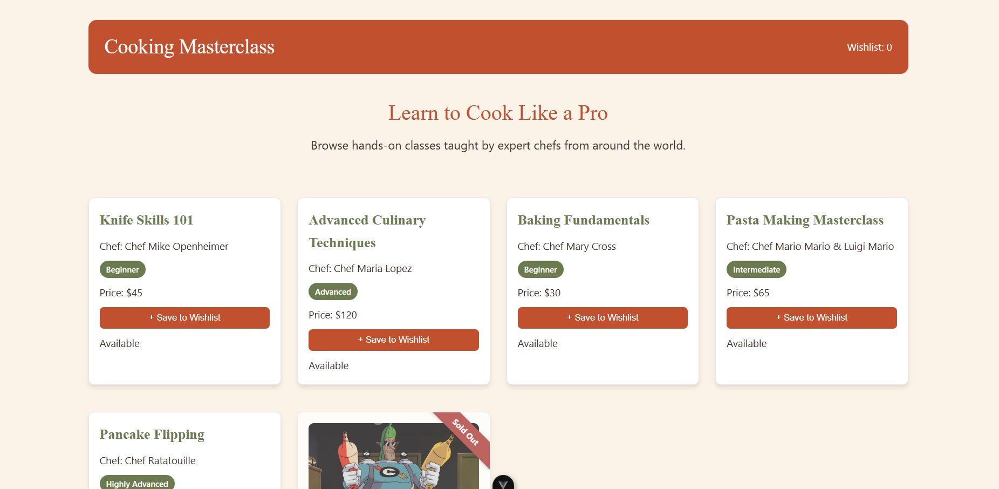

# COOKING MASTERCLASS CATALOGUE

A responsive Vue.js single-page catalogue for Cooking Masterclass, an online
platform for cooking workshops hosted by expert chefs. Built as Exercise 01
for Module 1 – Frontend Web Development.

## INSTALLATION & RUN INSTRUCTIONS
## Installing Project

1. Create a New Vue Project
Open your terminal and run:

npm create vue@latest

2. Follow the Vue Project Setup Wizard
When prompted:
Project Name:

cooking-masterclass-catalogue

3. Select the Following Features
** Navigate by using the up and down arrows ad select or deselect using the space bar.

When Vue asks which features you would like to include, select:

JSX Support
Vue Router
Pinia

4. Oxlint
When prompted about Oxlint:

Yes

Simply press Enter to accept the default option.

5. Example Project Files
When asked:

Skip all example code and start with a blank Vue project?
Select:

No

6. Complete the Installation
Follow the remaining instructions displayed in the terminal until the project setup is complete.

Replacing Pinia with Vuex
The project is initially configured with Pinia. The following steps will replace Pinia with Vuex.

7. Navigate Into Your Project
Move into your project directory:

cd cooking-masterclass-catalogue

8. Remove Pinia
Run:

npm uninstall pinia

9. Install Vuex
Run:

npm install vuex@latest

10. Update main.js
Open:

src/main.js
Remove:

import { createPinia } from 'pinia'

app.use(createPinia())
Add:

import store from './stores'

app.use(store)
Your updated main.js should look similar to:

import { createApp } from 'vue'
import App from './App.vue'
import router from './router'
import store from './stores'

const app = createApp(App)

app.use(router)
app.use(store)

app.mount('#app')

11. Rename the Store File
Navigate to:

src/stores
Rename:

counter.js
to:

index.js

12. Create the Vuex Store
Open:

src/stores/index.js
Remove all existing code and replace it with:

import { createStore } from 'vuex'

const store = createStore({
    state: {

    },

    mutations: {

    },

    actions: {

    }
})

export default store

13. Run the Application
Start the development server:

npm run dev

## Working in Project

1. Clone this repository:
   git clone https://github.com/james-johnston-49/cooking-masterclass-catalogue.git
   cd cooking-masterclass-catalogue
2. Install dependencies:
   npm install
3. Start the development server:
   npm run dev
4. Open the URL shown in the terminal (usually http://localhost:5173)

## OVERVIEW

This app displays a catalogue of cooking courses as cards, showing each
course's title, chef, skill level, and price. Users can save courses they're
interested in to a wishlist, with a live count shown in the page header.
Sold-out courses are clearly marked with a ribbon and can't be saved.

## FEATURES

- Dynamic course catalogue rendered from a local data file (no hard-coded duplicate cards)
- Wishlist counter in the header, powered by Vuex, with a pulse animation on update
- Diagonal "Sold Out" ribbon and dimmed styling for unavailable courses
- Responsive grid layout (desktop and mobile)
- Custom warm color palette (terracotta, olive, cream) and Google Font (Fraunces) for branding
- Hero banner section introducing the catalogue
- Component-driven design using props, local component state, and Vuex shared state

## TECH STACK

- Vue 3 (`<script setup>` Composition API)
- Vuex (shared wishlist state)
- Vue Router (included in the project template; not used for navigation in this single-page exercise)
- Vite (dev server & build tool)
- Plain CSS (scoped per component)

## PROJECT STRUCTURE

```
src/
├─ assets/
│  ├─ img/           # course image + screenshot
│  ├─ base.css
│  ├─ logo.svg
│  └─ main.css
├─ components/
│  ├─ AppHeader.vue  # Branding, wishlist count, pulse animation
│  └─ CourseCard.vue # Single course card (image, title, chef, price, save button, ribbon)
├─ data/
│  └─ courses.js     # Local course data (stand-in for a future API)
├─ router/
│  └─ index.js       # Vue Router config (included in template; not actively used for navigation)
├─ stores/
│  └─ index.js       # Vuex store — holds wishlistCount state
├─ views/
│  ├─ AboutView.vue  # Default template view; unused in this exercise
│  └─ HomeView.vue   # Main page — hero section + course grid
├─ App.vue           # Root component
└─ main.js           # App entry point
```

## SCREENSHOT

